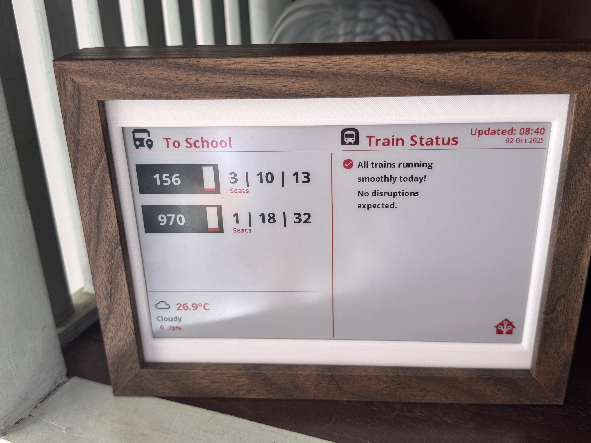
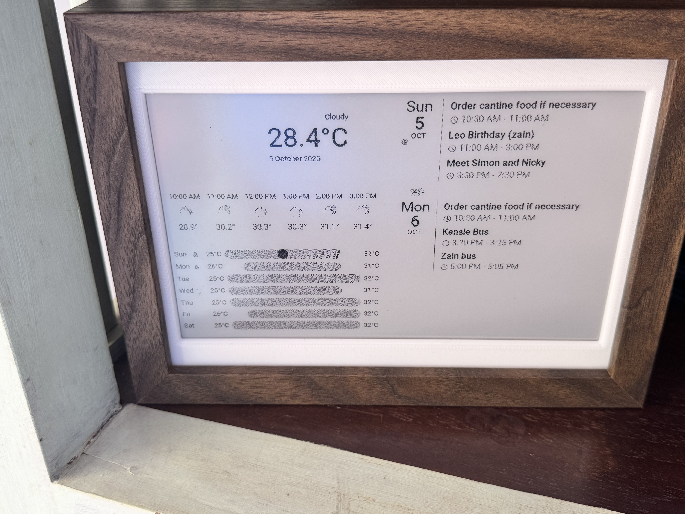
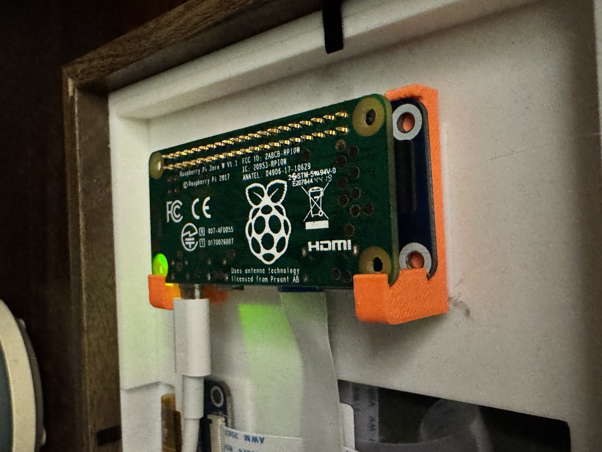

# mySGbusAuntie

***Disclaimer:*** this is my first project on this, I am by no means an expert and just do these fun projects on the side to challenge myself.

I’ve forked and adapted the code from [awesomelionel's project](https://github.com/awesomelionel/singapore-bus-timing-edisplay) to create my own version of the SGBusAuntie.

This project was a fun project that I keep tweaking but what I was trying to do was

1) In the mornings when my kids go to school they (like to original author of the code) need to know the buses and bus arrival times at the nearest bus stops where we live.
2) In addition because they take the train (subway / MRT) after the bus they need to know if there any distruptions along the route.
3) Once they have gone I dont need the display to show the bus times any more but rather some useful information, so I chose to display a dashboard from my homeassistant instance that shows weather for today, the 5 day outlook and also the calendar entries for today and the next day

#### Some pictures:
Bus Stop and Train display with weather

Alternate display from HomeAssistant once not in bus monitoring period

---

### Hardware 
(use the available sources in your country, for me it was a combination of amazon, lazada, shopee, cytron, aliexpress)
  1) Raspberry Pi Zero W (link later) with GPIO header pins (you can use a Pi Zero 2 W too!)
  2) Waveshare 7.5inch e-ink B/W/R (link later)
  3) HAT for Waveshare with GPIO interface for RPi (this makes it easier to install without soldering)
  4) IKEA picture frame (link later)
  5) Access to a 3D printer to print the parts needed (frame for display to sit on, internal frame and backing to hold frame down and for pi to sit on - link to follow for my STLs) 
  6) Power supply and cable for RPi in 1) above

Here is the mount using the IKEA picture frame

### Software
  1) All written in Pi and referncing the libraries from the original fork plus the waveshare libraries for the display
  2) You will need an AIP key to access the data from the LTA via their DataMall (link here) and for Data from OneMap or Google
  3) Assume you runnng a homeassistant instance in your home
  4) Install the Graphite Theme (link) and also Puppeteer add-in (link) on the homeassistant instance 

### Installation
  1) Follow the original authors suggestions to install the libraries and basic code
  2) Change the main.py to this version
  3) Setup your dashboard in home assistant and test the look and feel through your browser using the instructions in the Puppeteer add-on Github
  4) Adjust the parameter/config file to suit your situation [API key, bus stop codes, homeassistant instance, dashboard url, etc]
  5) Follow the original authors code to setup the file as a service to run when the Rpi boots

### Disclaimers
1) This was a weekend project and i am not a professional software engineer !
2) Yes there is optimisation to this code - happy for suggestions etc but will be updating as and when I get the time

### Future Enhancement Ideas

Potential features for future versions:
- [ ] Multiple bus stops with tabs + button to switch tabs
- [ ] Add a button and LED for refresh and reboot
- [ ] Add Air quality data next to the weather
- [ ] Add Calendar events from HA (only the days events)
- [ ] Add Web interface for configuration
- [✅] ~~Commute time estimates~~ (Added in v13.0)
- [✅] ~~Accessibility-optimized typography~~ (Added in v12.0)
- [✅] ~~Bold emphasis for key information~~ (Added in v12.0)

---

## Credits & Thanks

**Technologies Used:**
- Waveshare E-Ink Display (7.5" V2)
- Raspberry Pi Zero
- Python 3
- Material Design Icons v7.4.47
- Atkinson Hyperlegible Next Font (Braille Institute)
- Paho MQTT
- Home Assistant
- Singapore LTA DataMall API

-----

**Current Version: v13.0**  
**Status: Production Ready** ✅  
**Last Updated: October 5, 2025**  

-----

### Breaking Changes
V13 is backward compatible. Journey time feature is opt-in via the SHOW_JOURNEY_TIME=true

Journey time needs either teh OneMap from SG.gov or Goole Map APIs

OneMap: Register at https://www.onemap.gov.sg/apidocs/
Google Maps: Enable Directions API in Google Cloud Console

*For detailed code, see the main artifact.*  
*For issues or questions, refer to systemd service logs.*
