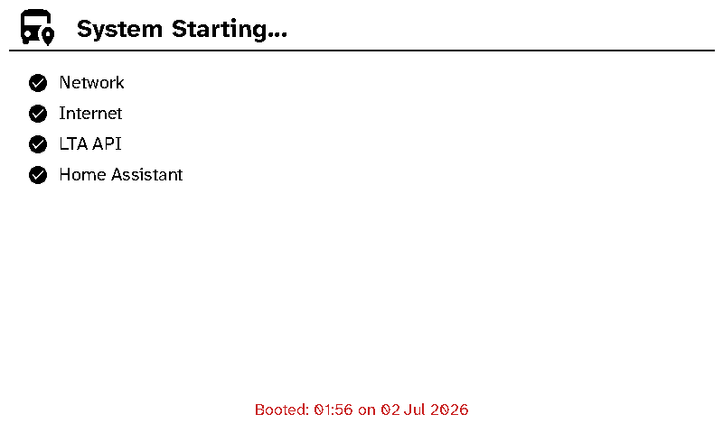
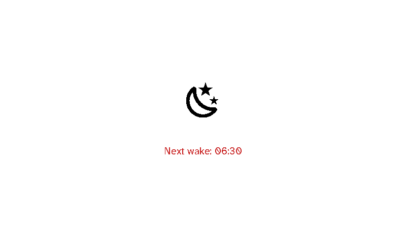
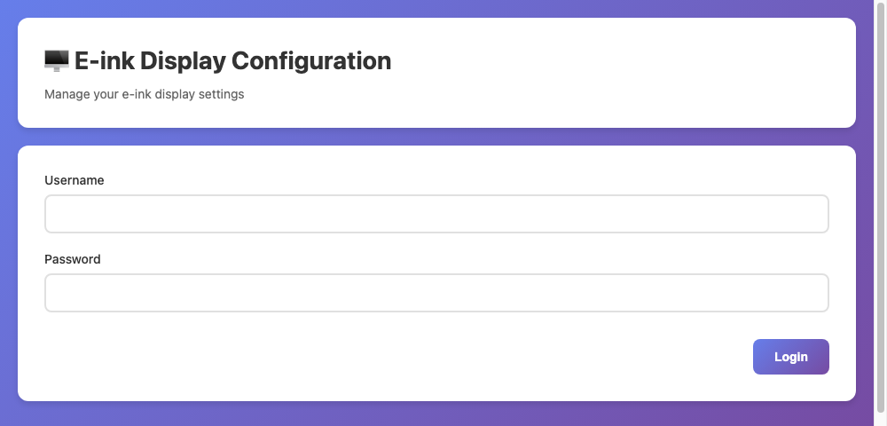
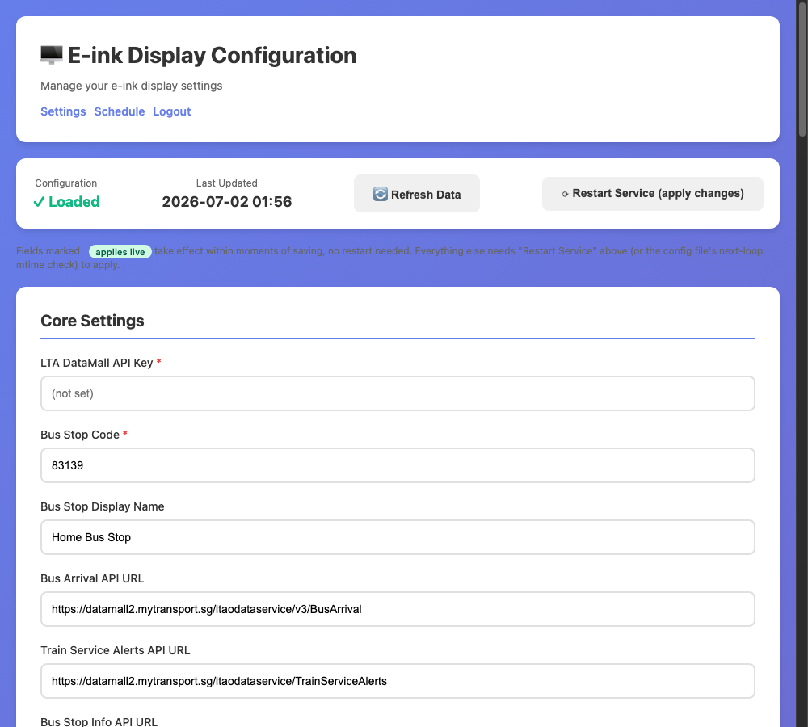
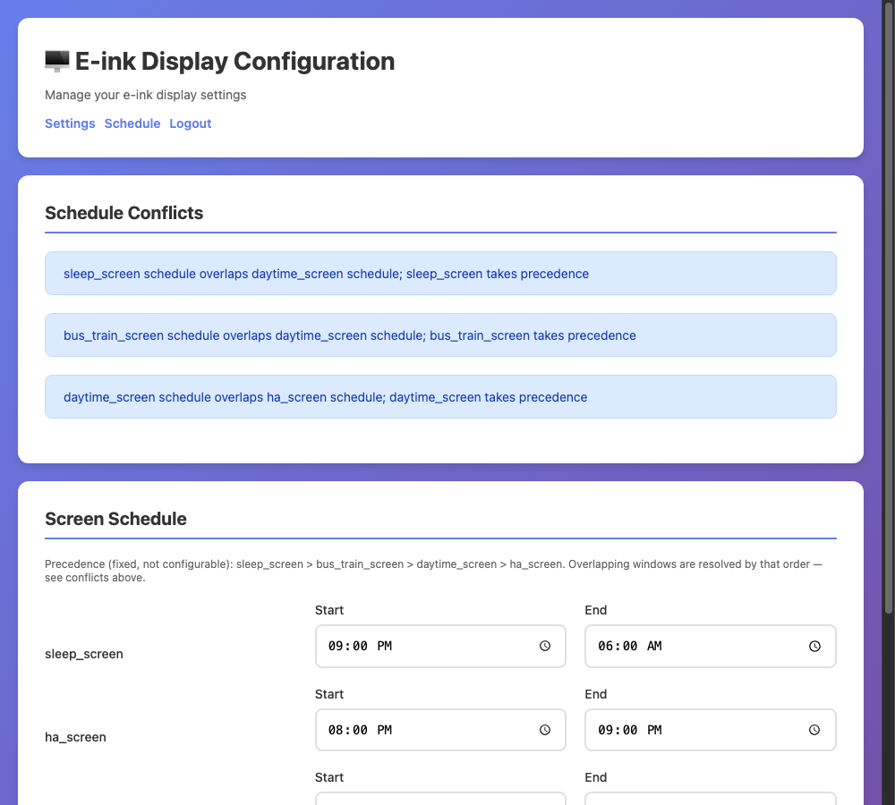

# mySGbusAuntie

***Disclaimer:*** this is my first project on this, I am by no means an expert and just do these fun projects on the side to challenge myself.

I've forked and adapted the code from [awesomelionel's project](https://github.com/awesomelionel/singapore-bus-timing-edisplay) to create my own version of the SGBusAuntie.

This project was a fun project that I keep tweaking but what I was trying to do was

1) In the mornings when my kids go to school they (like to original author of the code) need to know the buses and bus arrival times at the nearest bus stops where we live.
2) In addition because they take the train (subway / MRT) after the bus they need to know if there any distruptions along the route.
3) Once they have gone I dont need the display to show the bus times any more but rather some useful information, so I chose to display a dashboard from my homeassistant instance that shows weather for today, the 5 day outlook and also the calendar entries for today and the next day

Since then it's grown a fair bit past that original three-screen idea. I added journey-time estimates (v13 — not just "when's the bus" but "what time will they actually get there"), then went through a bigger rewrite (v14) once the single wake/sleep window started feeling too rigid: the display now cycles through **four** screens on their own independent schedules instead of just switching between "school mode" and the HA dashboard.

- The **bus/train screen** is the original idea above, now only shown on days it's actually needed — it checks two Home Assistant sensors each morning to work out if it's a school day, and skips itself entirely on weekends/holidays.
- There's a proper **overnight sleep screen** now too — just a moon icon and "next wake" time, no network calls at all, so it's not needlessly polling APIs at 2am.
- A **daytime placeholder** screen fills the gap on non-school days for now — it's genuinely just a blank page with "Day time screen" on it at the moment, real content for that is still on the to-do list.
- The old **Home Assistant dashboard screenshot** (the weather/calendar view from point 3 above) still exists, it's just dropped to the lowest priority now — it only shows if none of the other three screens claim that time slot.
- There's also a proper **boot checklist** now (network / internet / LTA API / Home Assistant, each with a tick or cross) instead of a plain "System Starting..." message, so I can tell at a glance what's actually working when it powers on.

The biggest addition though is a **web config panel** — a password-protected page at `http://<pi-ip>:5000` where I can change settings and edit the four screens' schedule from my phone, with conflict warnings if two windows overlap, instead of SSHing in and hand-editing files every time I want to tweak something.

#### Some pictures:
Bus Stop and Train display with weather

Alternate display from HomeAssistant once not in bus monitoring period

The new boot checklist (left) and the overnight sleep screen (right):

 

And the web config panel — login, settings, and the schedule editor with conflict warnings:

(These three web panel shots use sample/placeholder data, not my actual configuration.)

---

### Hardware 
(use the available sources in your country, for me it was a combination of amazon, lazada, shopee, cytron, aliexpress)
  1) Raspberry Pi Zero W (link later) with GPIO header pins (you can use a Pi Zero 2 W too!)
  2) Waveshare 7.5inch e-ink B/W/R (link later)
  3) HAT for Waveshare with GPIO interface for RPi (this makes it easier to install without soldering)
  4) IKEA picture frame (link later)
  5) Access to a 3D printer to print the parts needed (frame for display to sit on, internal frame and backing to hold frame down and for pi to sit on - link to follow for my STLs) 
  6) Power supply and cable for RPi in 1) above

Here is the mount using the IKEA picture frame

### Software
  1) All written in Python, using the Waveshare e-ink libraries plus the LTA DataMall, OneMap/Google, and Home Assistant APIs
  2) You will need an API key to access the data from the LTA via their DataMall, and (optionally) an API key from OneMap or Google Maps for journey-time estimates
  3) A running Home Assistant instance is optional but unlocks weather, the school-day/work-day scheduling, and the dashboard-screenshot screen
  4) If you want the HA dashboard screenshot screen, install the Graphite Theme and Puppeteer add-on on your Home Assistant instance

### Installation

**Full step-by-step instructions are in [How-to.md](How-to.md)** — clone, install dependencies, configure `.env` and the screen schedule, deploy both systemd services (the display + the web config panel), and verify it's working. That's the canonical setup guide now; this README is the backstory.

Short version:
1) Clone this repo onto your Pi
2) Install dependencies (`pigpio` via apt, everything else via `pip3 install -r requirements.txt --break-system-packages`)
3) Copy `.env.example` → `.env` and fill in your LTA DataMall API key, bus stop code, and (optionally) Home Assistant/routing details
4) Deploy `systemd/bus_display.service` (the display) and `systemd/web_config.service` (the browser-based settings panel, no SSH needed for day-to-day config changes)
5) If you want the HA dashboard screen, set up your dashboard and the Puppeteer add-on per its own GitHub instructions

### Disclaimers
1) This was a weekend project and i am not a professional software engineer !
2) Yes there is optimisation to this code - happy for suggestions etc but will be updating as and when I get the time
3) If something's not working, `journalctl -u bus_display -f` and `journalctl -u web_config -f` are the first place I'd look, and the troubleshooting section in [How-to.md](How-to.md) covers the common gotchas
4) The deeper docs ([architecture.md](architecture.md), [design.md](design.md), [specifications.md](specifications.md), [screen_layout.md](screen_layout.md)) go into more detail than most people will want, but they're there if you're curious how or why something works the way it does
5) `todo.md` has everything I know is still missing or half-baked (real content for the daytime screen, weather/calendar fallbacks for people without Home Assistant, and more)

---

### Future Enhancement Ideas

Potential features for future versions (see `todo.md` in this repo for the fuller, actively-maintained list):
- [ ] Multiple bus stops with tabs + button to switch tabs
- [ ] Add a button and LED for refresh and reboot
- [ ] Add Air quality data next to the weather
- [ ] Add Calendar events from HA (only the days events), plus a direct calendar (`.ics`) integration for anyone not running Home Assistant
- [ ] Weather fallback to a public API when Home Assistant isn't available
- [ ] Real content for the daytime placeholder screen (currently just says "Day time screen")
- [ ] A more modular/pluggable screen architecture (rolling screens, custom image slideshows, multiple HA dashboard targets)
- [ ] A font chooser, and a curated set of other e-ink-friendly fonts to pick from
- [✅] ~~Web interface for configuration~~ (Added in v14.0 — session auth, live schedule editor, one-click restart)
- [✅] ~~Commute time estimates~~ (Added in v13.0)
- [✅] ~~Accessibility-optimized typography~~ (Added in v12.0)
- [✅] ~~Bold emphasis for key information~~ (Added in v12.0)

---

## Credits & Thanks

**Technologies Used:**
- Waveshare E-Ink Display (7.5" V2)
- Raspberry Pi Zero
- Python 3, Flask
- Material Design Icons v7.4.47
- Atkinson Hyperlegible Next Font (Braille Institute)
- Paho MQTT
- Home Assistant
- Singapore LTA DataMall API

-----

**Current Version: v14.0**  
**Status: Production Ready** ✅  

-----

*For the full history of every version, see `Dev Log.md` and `ChangeLog.md`.*
